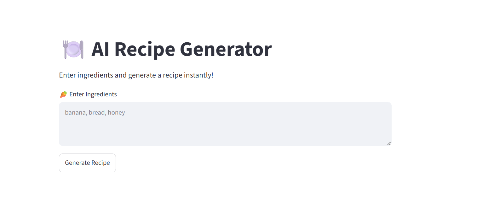
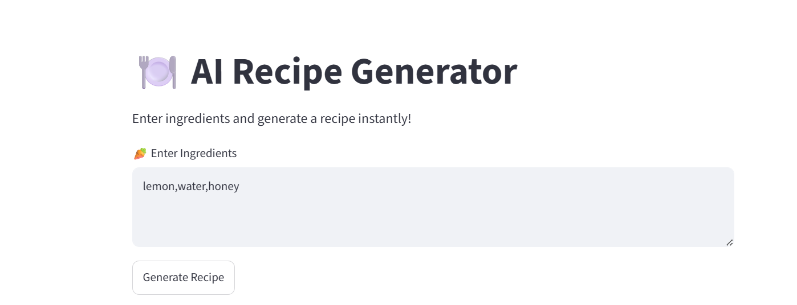
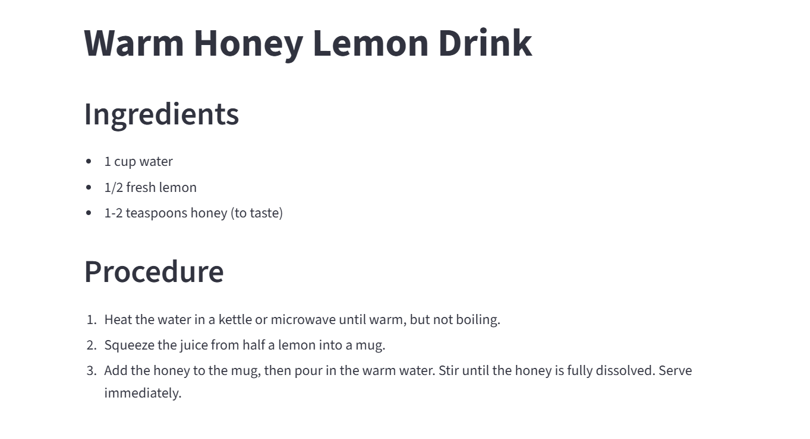

# 🍽️ AI Recipe Generator

An AI-powered Recipe Generator that creates delicious recipes from user-provided ingredients using LangChain and Google's Gemini API.

## 🌐 Live Demo

🔗 **Try the App:** https://ai-receipe-generator-6.streamlit.app/

---

##  Features

- Generate recipes from available ingredients
- AI-powered recipe recommendations
- Clean and interactive UI
- Instant recipe generation
- Powered by LangChain and Gemini API

---

##  Tech Stack

- Python
- Streamlit
- LangChain
- Google Gemini API

---

##  How It Works

1. Enter the ingredients you have available.
2. Click **Generate Recipe**.
3. AI analyzes the ingredients.
4. A complete recipe is generated instantly.

---

## 📸 Screenshots

### Home Page



### Recipe Generation



### Example Output



---

##  Example Input

```text
honey, lemon, water
```

## 🍴 Example Output

**Warm Honey Lemon Drink**

### Ingredients

- 1 cup water
- 1/2 fresh lemon
- 1–2 teaspoons honey

### Procedure

1. Heat the water until warm.
2. Squeeze half a lemon into a mug.
3. Add honey and stir until dissolved.
4. Serve immediately.

### Generated Recipe Screenshot


---

## 📂 Project Structure

```text
AI-Recipe-Generator/
│
├── app.py
├── requirements.txt
├── README.md
└── images/
    ├── home_page.png
    ├── recipe_generation.png
    └── generate_recipe.png
```

---

##  Future Enhancements

- Nutritional Information Analysis
- Cuisine-Based Recipe Suggestions
- Recipe Saving & Sharing
- Multi-Language Support
- Voice Input Support

---

##  Author

Developed using LangChain, Streamlit, and Google's Gemini API.
